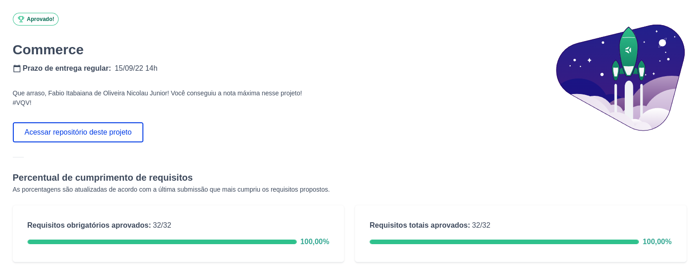

<h1>Sobre</h1>

Décimo primeiro projeto do módulo 3 - Back-end, da <a href="https://betrybe.com" target="_blank">Trybe!</a>

Dessa vez foi o projeto MongoDB Commerce. O desafio foi trabalhar com o banco de dados commerce, que contém dados do cardápio do McDonald's, como ingredientes, valores nutricionais e dados fictícios de vendas. 

Tivemos 32 desafios para solucionar com as querys do MongoDB.

<h1>Tecnologias utilizadas</h1>

<ul>
  <li>MongoDB</li>
</ul>

<h1>Nota</h1>

